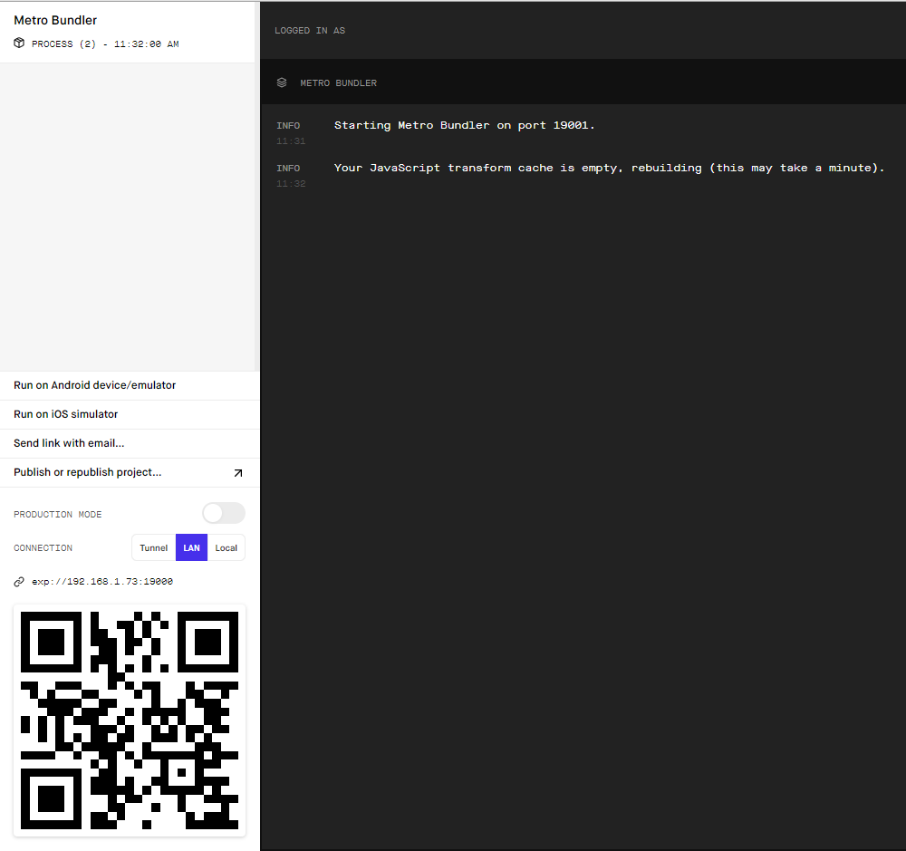

# App-almundo-hotels
Ejercicio-fullstack-mobile a React-Native App for check hotels


### Technologies
- Javascript / Typescript
- Node.js
- ES6
- React
- React-native
- gulp

# Prerequisites
- node.js
- git
- yarn
- expo-cli

# How to use

```
git clone https://github.com/cesarpelaez92/app-almundo-hotels.git
cd app-almundo-hotels
yarn install
```
# Steps to run the application
1. Commands to run the aplicacion ---> yarn "command"
    - start-dv: dev start
    - start-pr: Production start
    - android: Android Start    --> this command use a Emulator in your pc
    - ios: IOS start    --> this command use a Emulator in your pc
    - web: Web Start    --> Run the application in the browser is necessary to start the API in your localhost, please read the documentation https://                        github.com/cesarpelaez92/almundo-hotels-api
    - eject: expo Eject --> This will download the required dependencies and build Native projects under the ios and andriod directories
```
yarn start-st
```
2. If you dont have a Android or IOS emulator in your PC, install Expo app on your mobile device and Read the QR code open in explorer.
   
    

3. Just wait the app open in your device

